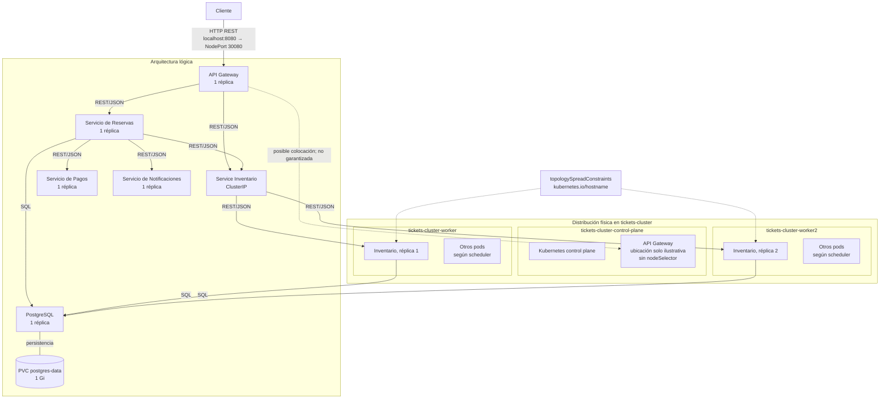

# Arquitectura

Las comunicaciones entre servicios son REST con JSON. El acceso desde el host llega a `localhost:8080`, que kind mapea al `NodePort 30080` del API Gateway. Las conexiones de Reservas e Inventario con PostgreSQL utilizan SQL.

Inventario es el único componente con una regla explícita de distribución: sus dos réplicas usan `topologySpreadConstraints` con `kubernetes.io/hostname`, por lo que se ubican en workers distintos. El API Gateway no tiene `nodeSelector`; su aparición en el control-plane es únicamente ilustrativa. Reservas, Pagos, Notificaciones y PostgreSQL tampoco tienen una ubicación fija y son asignados por el scheduler a un nodo disponible.

| Componente | Réplicas | Tipo de Service | Dependencia | Función |
|---|---:|---|---|---|
| API Gateway | 1 | NodePort `30080` | Reservas e Inventario | Punto de entrada externo y reenvío de solicitudes REST |
| Servicio de Reservas | 1 | ClusterIP | Inventario, Pagos, Notificaciones y PostgreSQL | Orquestar el flujo mínimo de reserva y persistir su resultado |
| Servicio de Inventario | 2 | ClusterIP | PostgreSQL | Consultar disponibilidad y reservar o liberar asientos mediante SQL atómico |
| Servicio de Pagos | 1 | ClusterIP | Ninguna | Simular la aprobación, latencia o fallo de un pago |
| Servicio de Notificaciones | 1 | ClusterIP | Ninguna | Simular el envío de una notificación |
| PostgreSQL | 1 | ClusterIP | PVC `postgres-data` de 1 Gi | Persistir inventario y reservas |
