<div align="center">

<p align="center">
  
</p>

# Sistemas Distribuidos
## Práctica de Tolerancia a Fallos
**Integrantes**  
Rafael Prieto  
Adrian Lazo

**Modalidad**  
Trabajo en parejas

**Fecha**  
28 de julio de 2026

</div>

---

# Resumen

La práctica implementa una plataforma simplificada de reservas de entradas para estudiar tolerancia a fallos mediante experimentación controlada. La solución conserva seis componentes: API Gateway, Reservas, Inventario, Pagos simulado, Notificaciones simulado y PostgreSQL. Los cinco servicios de aplicación utilizan Python 3.13 y FastAPI; la comunicación interna es REST con JSON y el estado se persiste con SQLAlchemy sobre PostgreSQL. El despliegue se define mediante manifiestos Kubernetes directos y un clúster kind con un nodo de control y dos workers. Inventario mantiene dos réplicas distribuidas por hostname, mientras los demás componentes tienen una réplica. Se implementaron cuatro escenarios: eliminación de un pod de Inventario, latencia de 20 segundos en Pagos, indisponibilidad total de Notificaciones y competencia concurrente por el último asiento. Las defensas correspondientes son replicación distribuida y reconciliación automática, timeout con Circuit Breaker, fallback no crítico y actualización SQL atómica. Las capturas experimentales documentan la topología, el flujo normal, la inyección y recuperación de servicios, y la preservación de consistencia bajo concurrencia. Diluvio de Peticiones y Base de Datos Intermitente se desarrollan como análisis de diseño para producción, sin presentarlos como mecanismos implementados.

# 1. Introducción

La tolerancia a fallos en sistemas distribuidos no puede evaluarse únicamente a partir de la descripción de patrones. La presencia de procesos independientes, redes, réplicas y almacenamiento persistente obliga a observar qué sucede cuando una dependencia deja de responder, responde tarde o recibe operaciones concurrentes. Por esta razón, el proyecto relaciona el análisis conceptual con fallos controlados y reproducibles sobre una aplicación desplegada en Kubernetes.

Provocar fallos de manera deliberada permite distinguir cuatro resultados técnicamente diferentes: recuperación automática de una réplica, rechazo controlado de una operación, degradación funcional mediante fallback y preservación de una invariante de consistencia. El objetivo general es construir la solución capaz de demostrar esas respuestas a los fallos causados.

# 2. Objetivos

## 2.1 Objetivo general

Construir y desplegar en Kubernetes multinodo una plataforma mínima de reservas de entradas que permita inyectar cuatro fallos controlados y demostrar recuperación, manejo controlado, degradación no crítica o preservación de consistencia, según corresponda.

## 2.2 Objetivos específicos

- Implementar los seis componentes definidos y su comunicación REST/JSON.
- Desplegar el sistema en un clúster kind con un nodo de control y dos workers.
- Mantener dos réplicas de Inventario distribuidas por hostname.
- Automatizar la construcción, carga, despliegue, inyección y recuperación.
- Limitar la indisponibilidad de Inventario mediante dos réplicas distribuidas y la recuperación automática del Deployment.
- Acotar la espera por Pagos con timeout y Circuit Breaker.
- Conservar una reserva confirmada cuando Notificaciones no esté disponible.
- Evitar la sobreventa del último asiento mediante una única actualización SQL atómica.
- Analizar, sin implementación, soluciones de producción para sobrecarga y conectividad intermitente con PostgreSQL.

# 3. Descripción del sistema

El API Gateway es el único punto de acceso externo. Expone rutas bajo `/api`, reenvía solicitudes con HTTPX y conserva el código y el cuerpo de la respuesta del servicio destino. Reservas coordina el proceso, genera el UUID, llama a Inventario, Pagos y Notificaciones, y persiste el estado. Inventario administra los asientos en PostgreSQL y aplica la operación atómica. Pagos y Notificaciones son simuladores sin base de datos: introducen latencia o fallos aleatorios según variables de entorno. PostgreSQL contiene una tabla de inventario y otra de reservas.

| Componente | Responsabilidad | Tecnología | Réplicas K8s | Dependencias | Service |
|---|---|---|---:|---|---|
| API Gateway | Entrada externa y proxy de Reservas e Inventario | FastAPI, HTTPX | 1 | Reservas, Inventario | NodePort `30080` |
| Reservas | Orquestar y persistir el flujo | FastAPI, HTTPX, SQLAlchemy | 1 | Inventario, Pagos, Notificaciones, PostgreSQL | ClusterIP |
| Inventario | Consultar, reservar, liberar y restablecer asientos | FastAPI, SQLAlchemy | 2 | PostgreSQL | ClusterIP |
| Pagos | Simular aprobación, latencia y fallo | FastAPI | 1 | Ninguna | ClusterIP |
| Notificaciones | Simular envío, latencia y fallo | FastAPI | 1 | Ninguna | ClusterIP |
| PostgreSQL | Persistir inventario y reservas | PostgreSQL 16 | 1 | PVC `postgres-data` | ClusterIP |

En el flujo normal, el cliente envía `POST /api/reservations` al Gateway. Este lo reenvía a `POST /reservations`. Reservas genera un identificador y solicita `POST /inventory/{event_id}/reserve`. Si se obtiene el asiento, llama a `POST /payments` y, después de la aprobación, a `POST /notifications`. Con el resultado de esa llamada, persiste la reserva como `confirmed` y guarda `notification_status` como `sent` o `pending`. Finalmente devuelve HTTP 201. El cliente puede consultar la reserva mediante `GET /api/reservations/{reservation_id}` y el inventario mediante `GET /api/inventory/{event_id}`.

# 4. Arquitectura e infraestructura Kubernetes

La configuración `kubernetes/cluster/kind-config.yaml` define un clúster `kind` con un `control-plane` y dos nodos `worker`. El puerto `30080` del nodo de control se mapea a `localhost:8080`. Los recursos de aplicación se crean en el namespace `tickets`.

Los manifiestos contienen seis Deployments y seis Services. Los servicios internos son ClusterIP; solo el Gateway es NodePort. Un ConfigMap centraliza URLs DNS internas, timeouts, retries, umbrales del Circuit Breaker y valores normales de latencia y fallo. Un Secret contiene credenciales exclusivamente de laboratorio y `DATABASE_URL`. PostgreSQL monta un ConfigMap con `init.sql` y un PVC sencillo de 1 Gi. Los servicios HTTP incluyen readiness y liveness probes en `/health`; PostgreSQL utiliza `pg_isready`. Todos los contenedores tienen requests y limits pequeños y `imagePullPolicy: IfNotPresent`.

Las direcciones `inventory`, `payments`, `notifications`, `reservations` y `postgres` corresponden a DNS de Services dentro del namespace. No se afirma una posición fija para Gateway, Reservas, Pagos, Notificaciones o PostgreSQL: el scheduler puede reprogramarlos. Inventario sí declara dos réplicas y `topologySpreadConstraints` con `maxSkew: 1`, `topologyKey: kubernetes.io/hostname` y `whenUnsatisfiable: DoNotSchedule`. En la evidencia guardada, las réplicas aparecen una en `tickets-cluster-worker` y otra en `tickets-cluster-worker2`.

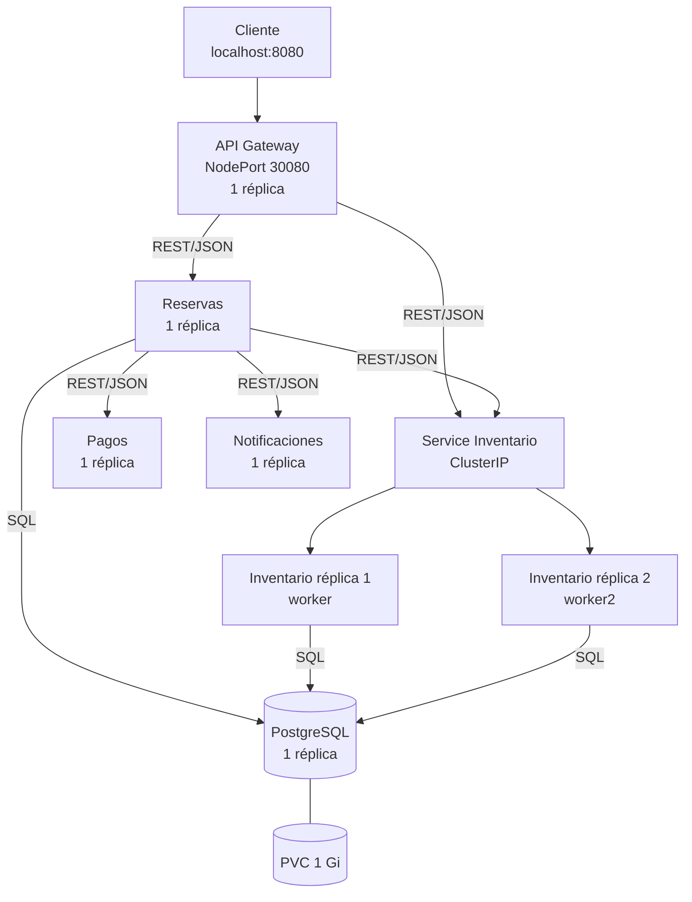
```mermaid
flowchart TB
    client["Cliente<br/>localhost:8080"]
    gateway["API Gateway<br/>NodePort 30080<br/>1 réplica"]
    reservations["Reservas<br/>1 réplica"]
    inventorySvc["Service Inventario<br/>ClusterIP"]
    inv1["Inventario réplica 1<br/>worker"]
    inv2["Inventario réplica 2<br/>worker2"]
    payments["Pagos<br/>1 réplica"]
    notifications["Notificaciones<br/>1 réplica"]
    postgres[("PostgreSQL<br/>1 réplica")]
    pvc[("PVC 1 Gi")]

    client --> gateway
    gateway -->|"REST/JSON"| reservations
    gateway -->|"REST/JSON"| inventorySvc
    reservations -->|"REST/JSON"| inventorySvc
    reservations -->|"REST/JSON"| payments
    reservations -->|"REST/JSON"| notifications
    reservations -->|"SQL"| postgres
    inventorySvc --> inv1
    inventorySvc --> inv2
    inv1 -->|"SQL"| postgres
    inv2 -->|"SQL"| postgres
    postgres --- pvc
```

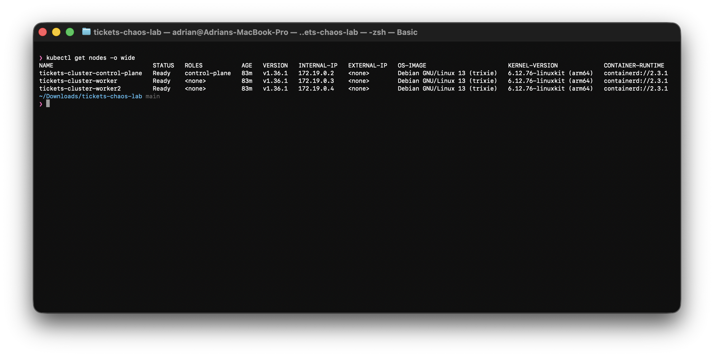

La Figura 1 muestra los tres nodos del clúster en estado `Ready`: un `control-plane` y dos workers. La salida confirma la topología multinodo definida en la configuración de kind.

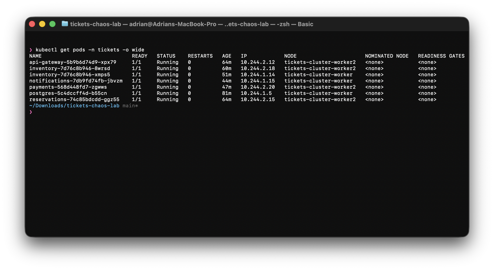

La Figura 2 ubica una réplica de Inventario en `tickets-cluster-worker` y la otra en `tickets-cluster-worker2`. Las posiciones de Gateway, Reservas, Pagos, Notificaciones y PostgreSQL corresponden a esa ejecución y no constituyen asignaciones permanentes.

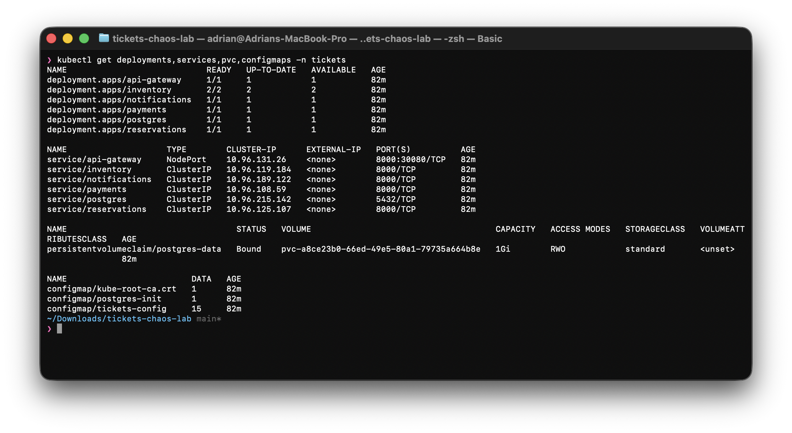

La Figura 3 registra los seis Deployments disponibles, los cinco Services internos ClusterIP, el Gateway NodePort `30080`, el PVC `postgres-data` enlazado con capacidad de 1 Gi y los ConfigMaps del namespace.

# 5. Implementación del flujo normal

1. **Recepción.** El Gateway recibe un JSON con `event_id`, `email` y `amount`, y lo reenvía a Reservas con un timeout configurable de 10 segundos.
2. **Reserva del asiento.** Reservas genera el UUID y llama a Inventario. Un HTTP 409 detiene el flujo antes del pago; una indisponibilidad dispara hasta tres intentos y después HTTP 503.
3. **Pago simulado.** Pagos espera `PAYMENT_DELAY_SECONDS`, evalúa `PAYMENT_FAILURE_RATE` y devuelve aprobación con un UUID de transacción o HTTP 503. No almacena tarjetas.
4. **Notificación.** Ante un pago aprobado, Notificaciones registra reserva y correo sin enviar un mensaje real. Su respuesta determina si `notification_status` será `sent` o `pending`.
5. **Persistencia.** Después del intento de notificación, Reservas añade una fila `confirmed` con el estado correspondiente. Si el pago falla, omite la notificación, intenta liberar una sola vez el asiento y registra `payment_failed` con notificación `not_sent`.
6. **Respuesta.** El éxito y el fallback de notificación devuelven HTTP 201; indisponibilidad de Inventario o fallo de Pagos devuelven HTTP 503 controlado, y ausencia de asientos devuelve HTTP 409.

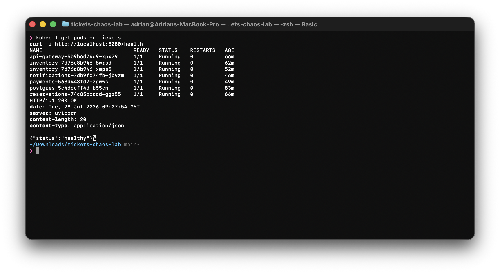

La Figura 4 presenta todos los pods en estado `Running` y listos, junto con una respuesta HTTP 200 y `{"status":"healthy"}` del Gateway. Esta comprobación establece el estado inicial del flujo normal.

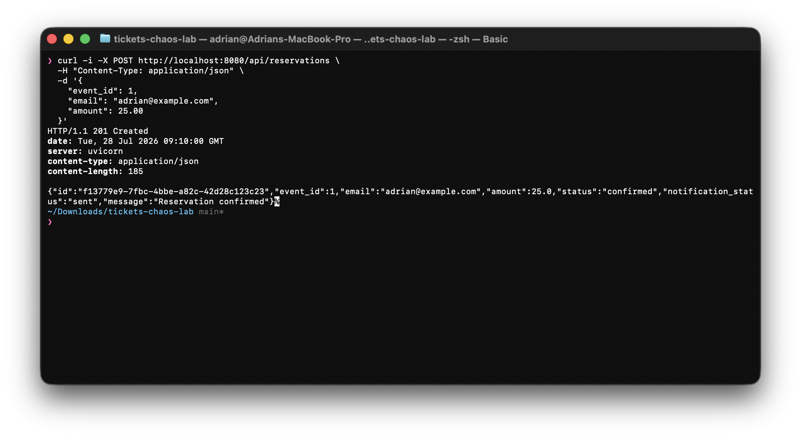

La Figura 5 muestra una respuesta HTTP 201 con UUID, evento, correo, importe, `status=confirmed` y `notification_status=sent`. El resultado verifica el recorrido exitoso por el flujo de reserva y la entrega simulada de la notificación.

# 6. Catálogo de los seis escenarios de fallo

| Escenario | Tipo de anomalía | Componente | Inyección | Defensa o solución | Estado y sección |
|---|---|---|---|---|---|
| Inventario Fantasma | Caída de instancia | Inventario | `kubectl delete pod` | Dos réplicas distribuidas y recuperación automática del Deployment | Implementado, §7.1 |
| Pasarela Lenta | Latencia excesiva | Pagos y Reservas | `PAYMENT_DELAY_SECONDS=20` y rollout | Timeout y Circuit Breaker | Implementado, §7.2 |
| Diluvio de Peticiones | Sobrecarga | API Gateway y dependencias | k6 o script de carga, solo propuesto | Rate limiting, HPA, límites, concurrencia y bulkheads | Analizado, §10.1 |
| Base de Datos Intermitente | Partición o degradación de red | PostgreSQL, Inventario y Reservas | Toxiproxy, NetworkPolicy compatible o reglas de red, solo propuestos | Retries seguros, Circuit Breaker, idempotencia y HA | Analizado, §10.2 |
| Correo Perdido | Indisponibilidad total no crítica | Notificaciones | Escalado a cero | Fallback con `notification_status=pending` | Implementado, §7.3 |
| Condición de Carrera | Concurrencia sobre recurso único | Inventario | Dos reservas simultáneas por un asiento | Actualización SQL atómica | Implementado, §7.4 |

# 7. Implementación de mecanismos de resiliencia

## 7.1 Inventario Fantasma

El fallo representa la pérdida de una instancia de Inventario. `scripts/faults/01-inventory-crash.sh` muestra los pods, selecciona uno y ejecuta `kubectl delete pod --wait=false`. No reduce el Deployment a cero. Durante la recreación realiza ocho consultas al inventario.

La defensa principal combina dos réplicas del Deployment, su distribución entre nodos mediante `topologySpreadConstraints` y la reconciliación automática de Kubernetes. El Service ClusterIP mantiene el acceso a la réplica disponible mientras el Deployment crea el reemplazo. Reservas también limita a tres los intentos cuando no logra contactar con Inventario y devuelve un HTTP 503 controlado si se agotan, pero ese manejo es secundario y no constituye el mecanismo principal de este escenario.

Antes del fallo deben existir dos pods listos. Durante la eliminación, el Service conserva al menos el endpoint saludable y el Deployment crea un reemplazo. Después, el rollout debe volver a dos réplicas. La elección es adecuada porque Inventario es crítico para impedir reservas sin asiento y su implementación es esencialmente sin estado fuera de PostgreSQL.

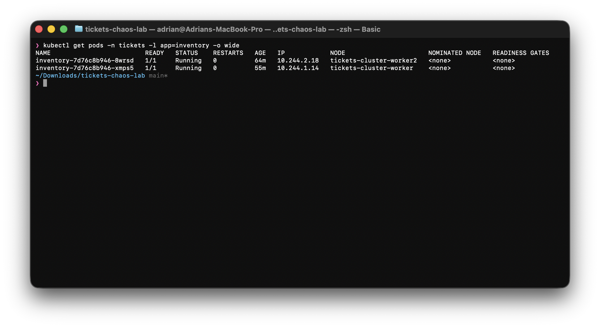

La Figura 6 registra las dos réplicas iniciales de Inventario listas, una en cada worker. Este estado permite eliminar una instancia sin perder todos los endpoints del Service.

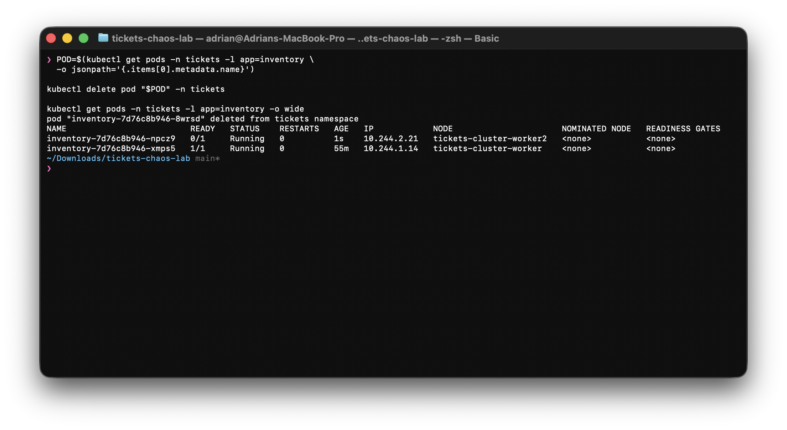

La Figura 7 identifica el pod eliminado y muestra que Kubernetes creó de inmediato un reemplazo con un segundo de antigüedad. Mientras el nuevo pod aún no estaba listo (`0/1`), la réplica del otro worker permaneció disponible (`1/1`).

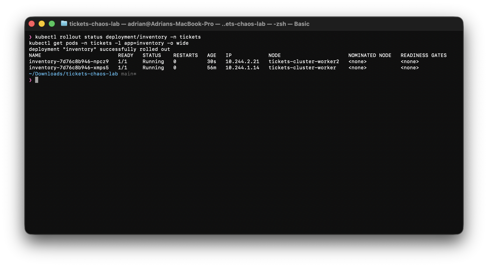

La Figura 8 muestra el rollout completado y las dos réplicas nuevamente listas. El pod con 30 segundos de antigüedad corresponde al reemplazo y la distribución entre los dos workers se conserva.

## 7.2 Pasarela Lenta

El script de inyección establece `PAYMENT_DELAY_SECONDS=20` en el Deployment `payments` y espera el rollout. Reservas configura `PAYMENT_TIMEOUT_SECONDS=3`. Por ello, una llamada lenta puede exceder el límite local aunque Pagos continúe procesándola; el timeout no equivale a cancelación remota.

El Circuit Breaker en memoria comienza en `CLOSED`. Cada fallo consecutivo incrementa el contador; con el umbral configurado de tres pasa a `OPEN`. En este estado se rechaza inmediatamente la llamada a Pagos. Tras `CIRCUIT_BREAKER_RECOVERY_SECONDS=20`, una llamada adquiere el estado `HALF_OPEN`: si tiene éxito, cierra y reinicia el contador; si falla, vuelve a abrir y reinicia el período. El mecanismo se mantiene dentro del pod de Reservas, por lo que un reinicio pierde su estado.

Ante cada fallo posterior a la reserva del asiento se llama una sola vez a `/inventory/{event_id}/release`; el resultado se registra, la reserva queda `payment_failed` y se devuelve HTTP 503. La combinación de timeout y circuito limita tanto la espera individual como la repetición de llamadas a una dependencia persistentemente lenta.

Antes de la inyección, la latencia configurada es cero. Durante el escenario, el script espera tres respuestas limitadas por el timeout y envía una cuarta para evidenciar el circuito abierto. En recuperación restablece la latencia a cero, espera el rollout y 22 segundos —los 20 configurados más un margen de dos— antes de probar una reserva.

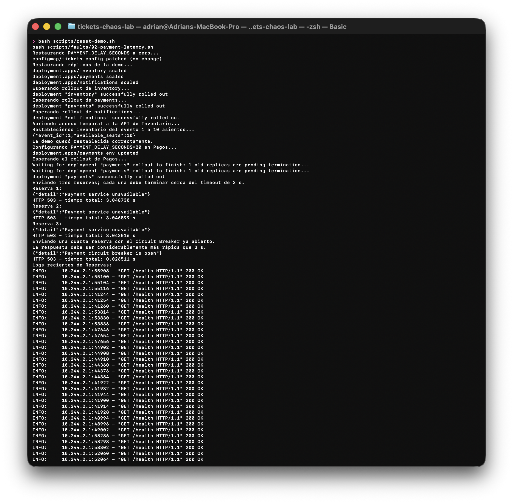

La Figura 9 documenta tres respuestas HTTP 503 en 3,048730 s, 3,046899 s y 3,043016 s, coherentes con el timeout configurado de tres segundos. La cuarta respuesta devuelve HTTP 503 en 0,026511 s con `Payment circuit breaker is open`, lo que diferencia el rechazo inmediato del timeout.

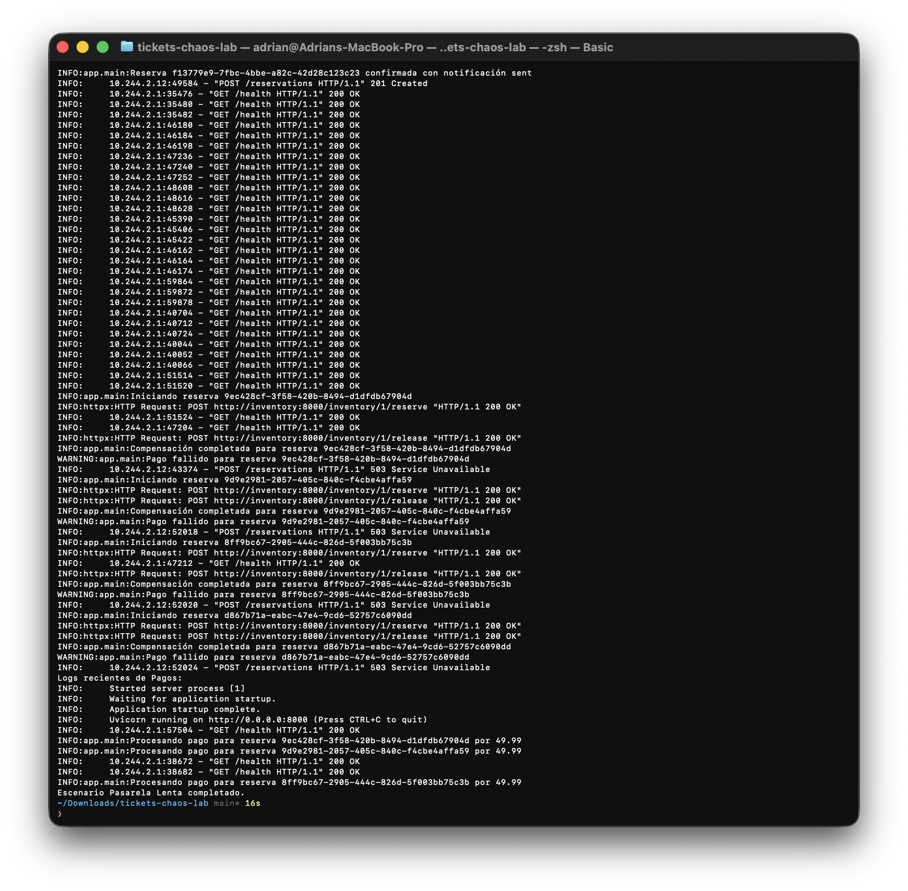

La Figura 9.1 muestra que cada fallo de pago fue seguido por una llamada exitosa a `/inventory/1/release` y por el registro `Compensación completada`. La compensación evita conservar el asiento cuando el pago no pudo confirmarse.

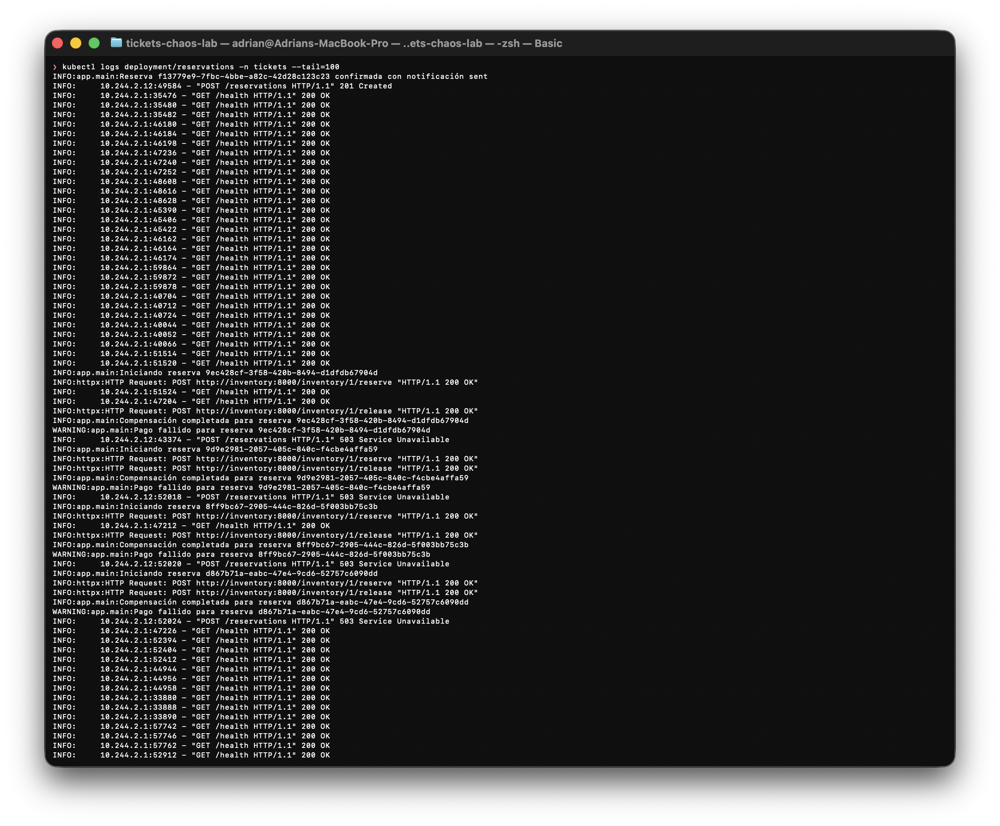

La Figura 10 conserva los logs de Reservas para las cuatro respuestas 503 y sus liberaciones de inventario. La evidencia temporal de la transición a `OPEN` se observa en la cuarta respuesta de la Figura 9; el Circuit Breaker no se presenta como retry, sino como rechazo temporal de nuevas llamadas a Pagos.

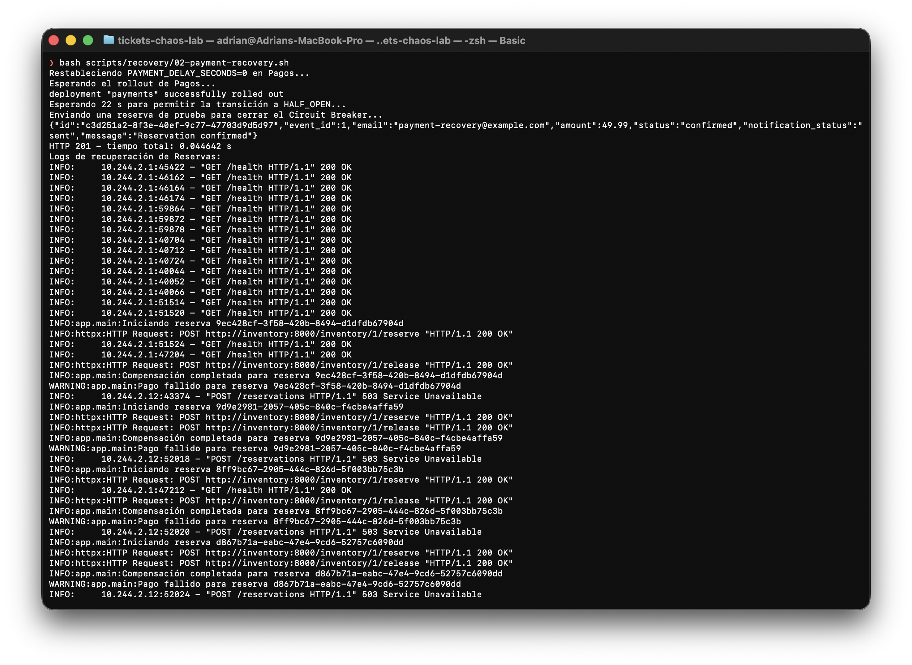

La Figura 11 registra `PAYMENT_DELAY_SECONDS=0`, el rollout, la espera de 22 segundos y una reserva de prueba HTTP 201 en 0,044642 s con notificación enviada. El resultado corresponde a una llamada permitida después del período de recuperación.

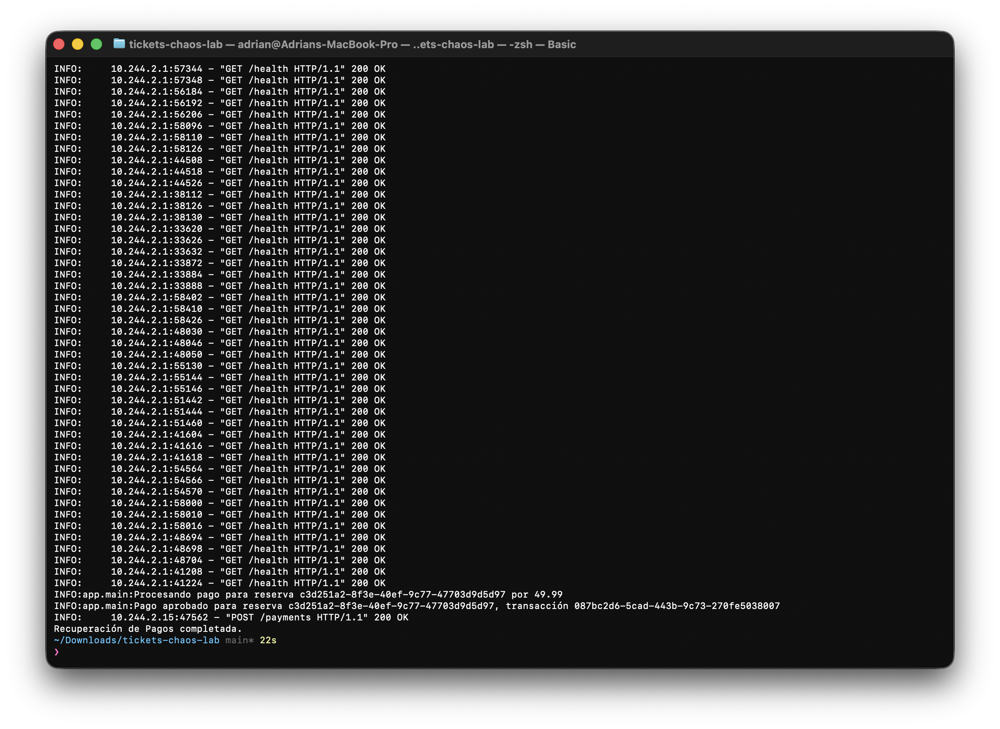

La Figura 11.1 muestra en los logs de Pagos el procesamiento y aprobación de la reserva de recuperación, con respuesta HTTP 200. El éxito de esta llamada devuelve el circuito a `CLOSED`.

## 7.3 Correo Perdido

`scripts/faults/03-notification-down.sh` escala `deployment/notifications` a cero y verifica que no existan pods. La notificación ocurre después de aprobar el pago; por ello se considera un efecto no crítico respecto de la compra. Si HTTPX recibe error, timeout o estado no exitoso, Reservas conserva `status=confirmed`, asigna `notification_status=pending`, persiste la fila y responde HTTP 201 con un mensaje explícito.

Cancelar una compra ya pagada por no poder enviar un correo introduciría un acoplamiento innecesario y podría crear un nuevo problema de compensación. El fallback conserva el resultado principal y hace visible la degradación. La recuperación escala nuevamente a una réplica y comprueba que una nueva reserva quede `sent`; no reenvía reservas anteriores en `pending`.

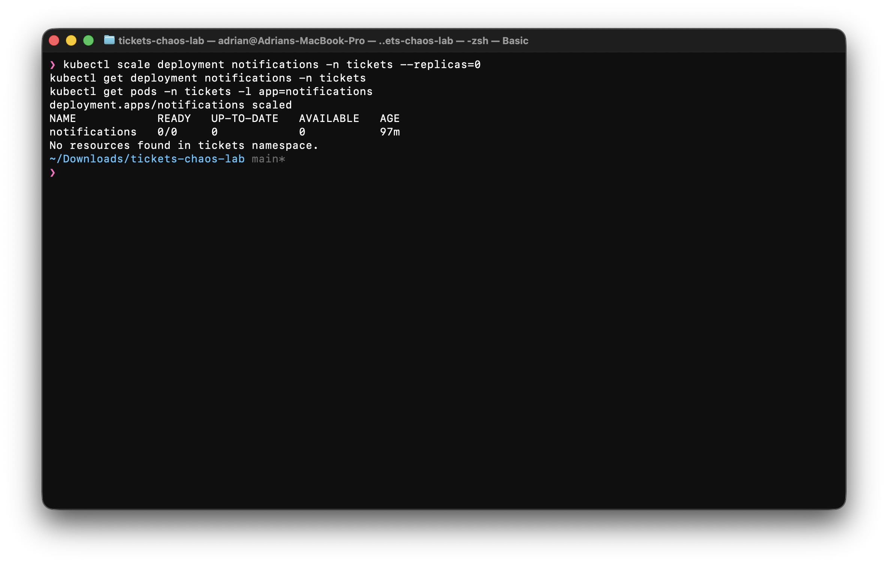

La Figura 12 muestra el Deployment de Notificaciones escalado a `0/0` y la ausencia de pods con la etiqueta `app=notifications`. Se trata de una indisponibilidad total de la dependencia, no de una recuperación automática.

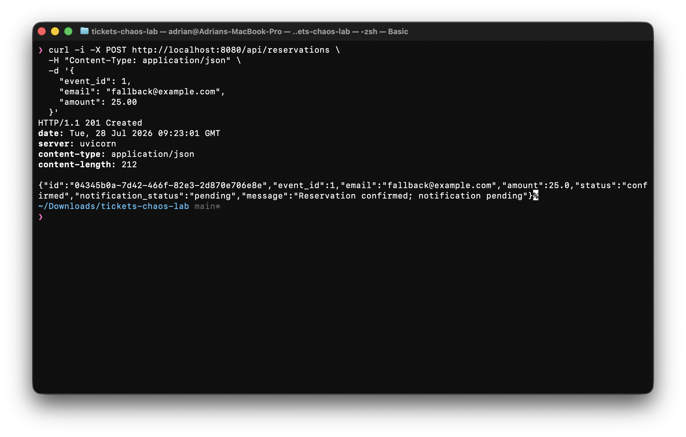

La Figura 13 registra una reserva HTTP 201 mientras Notificaciones permanece inactivo. El cuerpo conserva `status=confirmed` y asigna `notification_status=pending`, por lo que la evidencia corresponde a un fallback y no a la recuperación del servicio.

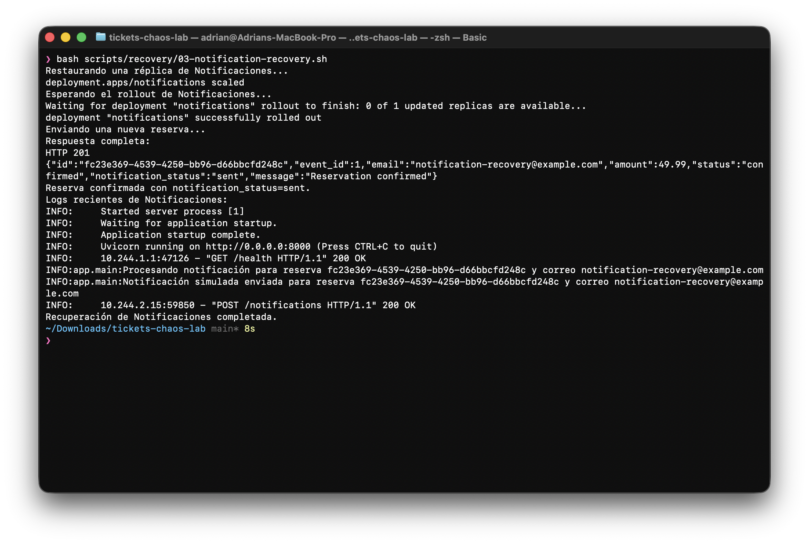

La Figura 14 muestra el escalado a una réplica, el rollout exitoso y una nueva reserva HTTP 201 con `notification_status=sent`. Los logs de Notificaciones registran el procesamiento simulado y la respuesta HTTP 200.

## 7.4 Condición de Carrera

Una solución `SELECT` seguido de `UPDATE` sería vulnerable a *check-then-act*: dos solicitudes podrían leer el mismo último asiento antes de modificarlo y ambas continuar. El servicio evita esa ventana al comprobar y descontar en una única sentencia:

```sql
UPDATE inventory
SET available_seats = available_seats - 1
WHERE event_id = :event_id
  AND available_seats > 0
RETURNING available_seats;
```

Si ninguna fila se actualiza, Inventario devuelve HTTP 409 y Reservas no intenta el pago. El script `04-race-condition.py` restablece un asiento, sincroniza dos tareas `asyncio` con correos distintos y verifica automáticamente una respuesta HTTP 201, una HTTP 409 y un inventario final de cero.

`evidence/race-condition/result.txt` conserva una ejecución con una respuesta 409, otra 201 y saldo final cero. La captura de la Figura 15 corresponde a otra ejecución del mismo script y conserva la misma invariante con el orden de resultados invertido.

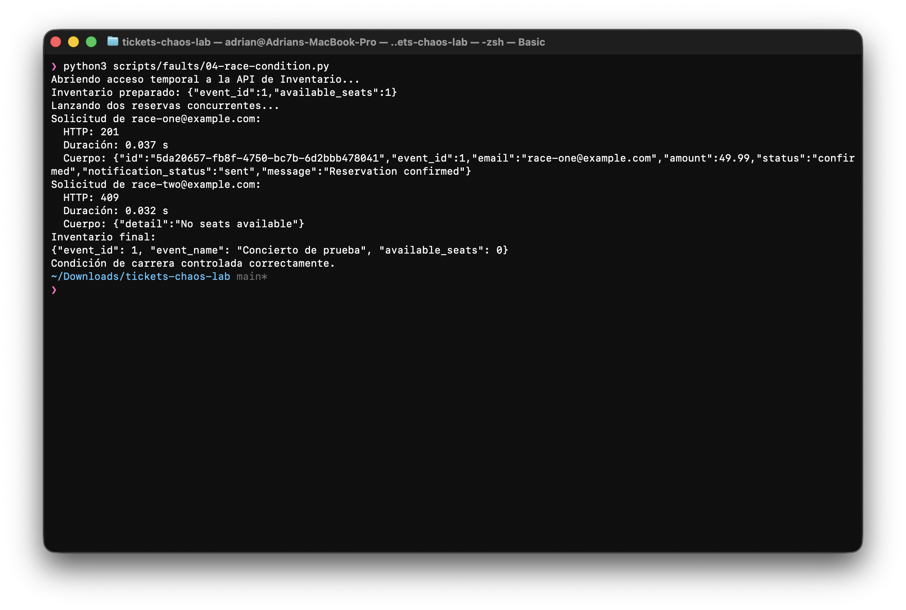

La Figura 15 muestra `race-one@example.com` con HTTP 201 en 0,037 s y `race-two@example.com` con HTTP 409 en 0,032 s. El script informa “Condición de carrera controlada correctamente”, porque solo una solicitud confirmó la compra.

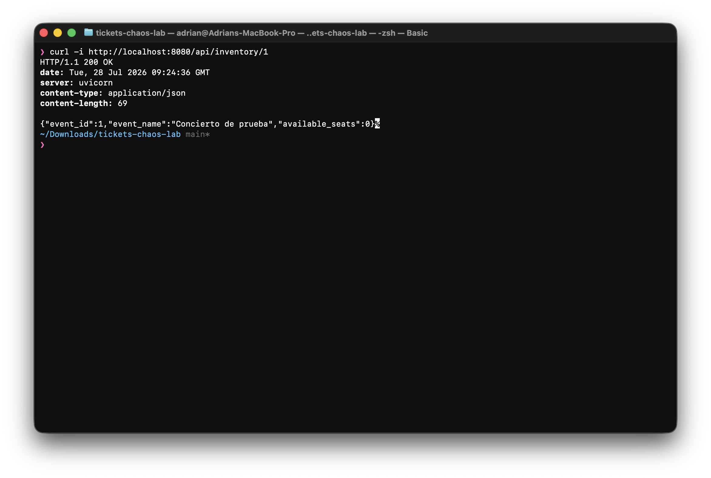

La Figura 16 confirma mediante `GET /api/inventory/1` que `available_seats` termina en cero. La respuesta HTTP 200 permite verificar que no hubo valor negativo ni sobreventa.

# 8. Evidencia experimental y resultados

| Escenario | Estado inicial verificable | Fallo inyectado | Comportamiento observado o verificable | Mecanismo | Estado final | Evidencia |
|---|---|---|---|---|---|---|
| Inventario Fantasma | Dos pods en workers distintos | Eliminación de un pod | Se creó un reemplazo mientras la otra réplica permaneció lista | **Recuperación automática** del Deployment, Service y réplica | Dos réplicas listas y distribuidas | Figuras 6–8; `evidence/inventory/pods-after-delete.txt` |
| Pasarela Lenta | Latencia normal en cero | Retardo de 20 s | Tres respuestas 503 cercanas al timeout; cuarta respuesta 503 inmediata; liberación de asientos | **Error controlado**, timeout, Circuit Breaker y compensación | Reserva 201 después del período de recuperación | Figuras 9–11.1; `evidence/payments/payment-latency.txt` |
| Correo Perdido | Una réplica disponible | Escalado a cero | Reserva 201 confirmada con notificación `pending` | **Fallback** no crítico | Una réplica restaurada y nueva reserva con `sent` | Figuras 12–14; `evidence/notifications/notification-down.txt` |
| Condición de Carrera | Un asiento tras reset | Dos solicitudes concurrentes | Una respuesta 201, una 409 e inventario final cero | **Preservación de consistencia** mediante SQL atómico | Cero asientos, sin sobreventa | Figuras 15–16; `evidence/race-condition/result.txt` |

La tabla evita denominar “recuperación” a todos los casos. Inventario recupera capacidad mediante reconciliación; Pagos rechaza de forma controlada y compensa; Notificaciones degrada una función secundaria; la carrera conserva una invariante.

# 9. Guion de demostración

El repositorio propone una demo de aproximadamente 13 minutos y 30 segundos, dentro del rango de 10 a 15 minutos. La siguiente asignación es una **organización de la exposición**.

| Orden | Responsable propuesto | Comando principal | Resultado esperado |
|---:|---|---|---|
| 1. Clúster | Adrian Lazo | `kubectl get nodes -o wide` y `kubectl -n tickets get pods -o wide` | Tres nodos y dos réplicas de Inventario distribuidas |
| 2. Inventario Fantasma | Adrian Lazo | `./scripts/faults/01-inventory-crash.sh` | Eliminación y recreación de un pod sin escalar a cero |
| 3. Pasarela Lenta | Rafael Prieto | `./scripts/faults/02-payment-latency.sh` | Tres fallos limitados por timeout y cuarta llamada rechazada por circuito |
| 4. Correo Perdido | Rafael Prieto | `./scripts/faults/03-notification-down.sh` | Reserva 201 confirmada con `notification_status=pending` |
| 5. Condición de Carrera | Adrian Lazo | `python3 scripts/faults/04-race-condition.py` | Una 201, una 409 e inventario cero |
| 6. Recuperación y cierre | Rafael Prieto | `./scripts/reset-demo.sh` y `./scripts/verify-cluster.sh` | Réplicas y variables restauradas; verificación final |

Cada escenario dispone además de recuperación específica:

```bash
./scripts/recovery/01-inventory-recovery.sh
./scripts/recovery/02-payment-recovery.sh
./scripts/recovery/03-notification-recovery.sh
./scripts/recovery/04-race-condition-reset.sh
```

La preparación exige Docker Desktop, clúster creado, imágenes cargadas, pods listos, inventario en diez, latencias en cero y Pagos/Notificaciones con una réplica. El plan de contingencia utiliza logs y evidencia guardada; no reconstruye imágenes ni edita YAML durante la exposición.

# 10. Análisis y diseño de los fallos no implementados

Las siguientes medidas son propuestas de producción tomadas del análisis interno del repositorio. No están implementadas en el laboratorio.

## 10.1 Diluvio de Peticiones

Un volumen de entrada superior a la capacidad del Gateway saturaría CPU, memoria, workers, sockets o conexiones. Cada reserva aceptada amplifica trabajo hacia Reservas, tres servicios y PostgreSQL. Al crecer las colas aumenta la latencia; una dependencia lenta retiene recursos de su cliente y puede propagar un fallo en cascada. El sistema carece de backpressure explícito, rate limiting, HPA y límites de concurrencia.

Una solución de producción combinaría rate limiting en el Gateway, máximo de solicitudes activas, cola pequeña y acotada, requests y limits dimensionados, HPA, varias réplicas y bulkheads separados por dependencia. Una cola externa solo sería apropiada para trabajo que admita procesamiento diferido y requeriría idempotencia; no forma parte del laboratorio.

```text
al recibir solicitud:
    si el límite por cliente fue superado:
        devolver 429
    si no existe cupo de concurrencia:
        devolver 503 o 429 con Retry-After
    reservar cupo
    intentar:
        ejecutar con timeout
        devolver resultado
    finalmente:
        liberar cupo
```

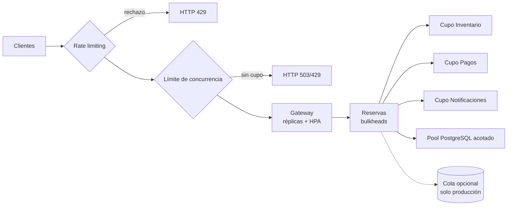
```mermaid
flowchart LR
    clients["Clientes"] --> limiter{"Rate limiting"}
    limiter -->|rechazo| r429["HTTP 429"]
    limiter --> concurrency{"Límite de concurrencia"}
    concurrency -->|sin cupo| busy["HTTP 503/429"]
    concurrency --> gateway["Gateway<br/>réplicas + HPA"]
    gateway --> reservations["Reservas<br/>bulkheads"]
    reservations --> inventory["Cupo Inventario"]
    reservations --> payments["Cupo Pagos"]
    reservations --> notifications["Cupo Notificaciones"]
    reservations --> db["Pool PostgreSQL acotado"]
    reservations -.-> queue[("Cola opcional<br/>solo producción")]
```

El rechazo temprano conserva recursos, pero reduce disponibilidad percibida. El HPA reacciona después del aumento y no elimina picos instantáneos. Más réplicas no resuelven un PostgreSQL saturado. Los bulkheads aíslan dependencias, aunque pueden reservar capacidad ociosa. Los límites mal dimensionados pueden rechazar tráfico legítimo o desperdiciar recursos.

## 10.2 Base de Datos Intermitente

Una pérdida intermitente de conectividad puede provocar rechazos, latencia, resets, *flapping* y conexiones inválidas en el pool. El caso crítico ocurre cuando se pierde la respuesta alrededor de un `COMMIT`: el cliente desconoce si la escritura se confirmó. Reintentar indiscriminadamente podría duplicar operaciones o efectos externos.

CAP solo es pertinente cuando existe una partición de comunicación entre componentes distribuidos. Ante esa partición no pueden garantizarse simultáneamente consistencia fuerte y disponibilidad para todas las operaciones. No explica por sí solo cualquier timeout o degradación de una base de datos.

La propuesta combina timeouts de conexión, adquisición y consulta; retries pequeños solo para errores transitorios; exponential backoff con jitter; Circuit Breaker; claves de idempotencia persistidas; transacciones; pool acotado y validado; PostgreSQL de alta disponibilidad; y Outbox cuando existan efectos externos asíncronos.

```text
procesar(clave, datos):
    si circuito OPEN:
        devolver error controlado
    para intento en 0..2:
        intentar:
            iniciar transacción
            si existe clave:
                devolver resultado previo
            aplicar cambio
            guardar clave, resultado y Outbox si corresponde
            commit
            registrar éxito y devolver
        ante error transitorio:
            rollback si es posible
            si commit es incierto, consultar primero la clave
            si no quedan intentos, devolver error controlado
            esperar min(base * 2^intento, máximo) + jitter
```

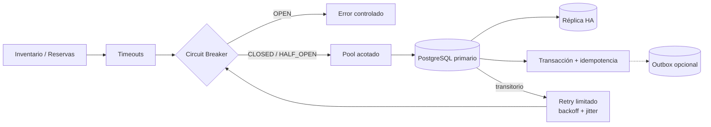
```mermaid
flowchart LR
    service["Inventario / Reservas"] --> timeout["Timeouts"]
    timeout --> breaker{"Circuit Breaker"}
    breaker -->|OPEN| controlled["Error controlado"]
    breaker -->|CLOSED / HALF_OPEN| pool["Pool acotado"]
    pool --> primary[("PostgreSQL primario")]
    primary --> replica[("Réplica HA")]
    primary --> tx["Transacción + idempotencia"]
    tx -.-> outbox[("Outbox opcional")]
    primary -->|transitorio| retry["Retry limitado<br/>backoff + jitter"]
    retry --> breaker
```

Los timeouts demasiado cortos producen falsos fallos y los largos retienen recursos. Los retries aumentan carga y solo son seguros con semántica conocida. La idempotencia requiere almacenamiento y retención. La alta disponibilidad aumenta coste y complejidad; replicación asíncrona admite pérdida reciente y la síncrona aumenta latencia. Outbox exige publicación y consumidores idempotentes.


# 11. Control de versiones y reproducibilidad

El repositorio separa servicios, base de datos, configuración de kind, manifiestos, scripts, documentación y evidencia. El historial disponible contiene 23 commits incrementales, desde la estructura inicial hasta servicios, despliegue, escenarios y documentación.

La reproducción está automatizada por `build-images.sh`, que construye cinco imágenes `tickets/*:1.0`; `load-images.sh`, que las carga en `tickets-cluster`; y `deploy.sh`, que aplica los manifiestos y espera los seis rollouts. `verify-cluster.sh` consulta nodos, pods, salud del Gateway e inventario. Cada fallo tiene un script de inyección y otro de recuperación; `reset-demo.sh` restaura réplicas, latencia e inventario. El README reúne requisitos, despliegue, llamadas de ejemplo, escenarios y limpieza.

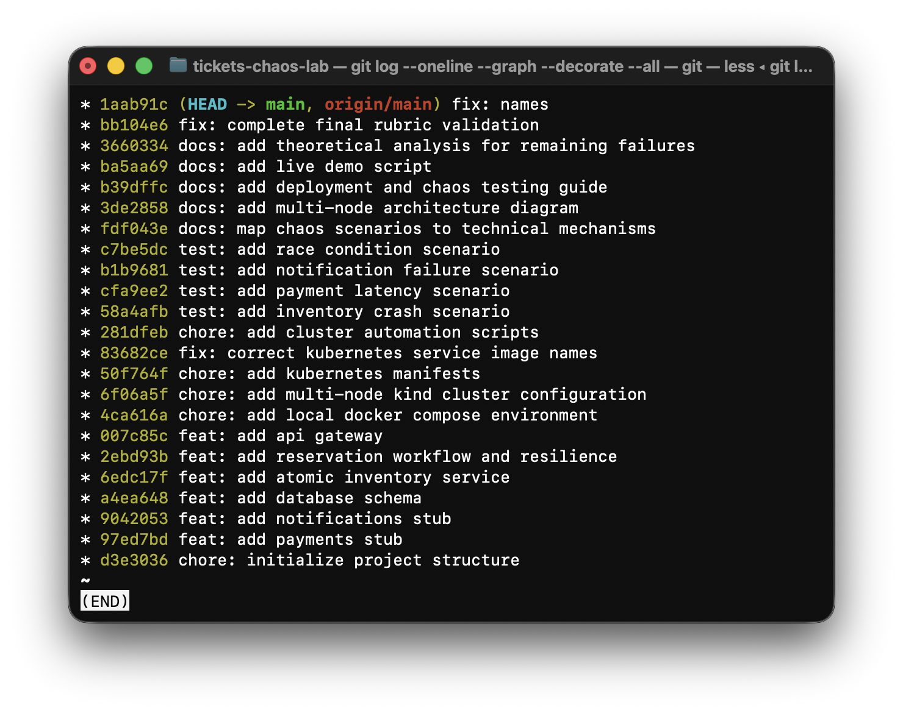

La Figura 17 muestra 23 commits incrementales que recorren la estructura inicial, servicios, base de datos, despliegue, automatización, escenarios y documentación. El repositorio remoto configurado es `https://github.com/scomygod/practica-tolerancia-fallos.git`.


# 12. Conclusiones

1. El clúster kind de tres nodos permite demostrar distribución lógica multinodo; las dos réplicas de Inventario aparecen en workers distintos y el Deployment puede reconciliar una instancia eliminada.
2. La defensa principal de Inventario es el Deployment con dos réplicas distribuidas y su reconciliación automática. El Service y la readiness conservan el acceso a la réplica saludable; los retries limitados de Reservas solo aportan un manejo secundario ante indisponibilidad transitoria.
3. El timeout de tres segundos limita la espera ante los veinte segundos configurados en Pagos, mientras el Circuit Breaker evita insistir después de tres fallos; la compensación separada intenta devolver el asiento reservado.
4. El fallback de Notificaciones muestra degradación funcional: la compra permanece confirmada y el efecto secundario adopta `notification_status=pending`, en lugar de tratar toda indisponibilidad como cancelación.
5. La actualización SQL con condición `available_seats > 0` preserva la consistencia bajo concurrencia. La evidencia guardada confirma una sola reserva exitosa, una rechazada con HTTP 409 y saldo final cero.
6. Los escenarios distinguen recuperación automática, error controlado, fallback y consistencia. El análisis de sobrecarga y base intermitente evidencia que evolucionar a producción exigiría mecanismos e infraestructura que no deben atribuirse al laboratorio actual.

# 13. Recomendaciones

- PostgreSQL de alta disponibilidad, backups y pruebas de failover para una evolución de producción.
- Persistencia o externalización del estado del Circuit Breaker únicamente ante una topología con varias réplicas de Reservas y política compartida.
- Reenvío idempotente de notificaciones con estado `pending` mediante Outbox y procesamiento asíncrono cuando el alcance lo permita.
- Validación de capacidad previa a la incorporación de HPA, rate limiting, bulkheads y límites de concurrencia.
- Correlación estructurada de logs y métricas básicas para experimentos de mayor escala.

# 14. Anexos

## Anexo A. Manifiestos

| Archivo | Recursos principales |
|---|---|
| `kubernetes/cluster/kind-config.yaml` | Un control-plane, dos workers y mapeo 8080→30080 |
| `00-namespace.yaml` | Namespace `tickets` |
| `01-configmap.yaml` | URLs, timeouts, retries, circuito, latencias y tasas |
| `02-secret.yaml` | Credenciales de laboratorio y `DATABASE_URL` |
| `03-postgres.yaml` | ConfigMap de inicialización, PVC, Deployment y Service |
| `04-inventory.yaml` | Deployment de dos réplicas, topology spread y Service |
| `05-payments.yaml` | Deployment y Service de Pagos |
| `06-notifications.yaml` | Deployment y Service de Notificaciones |
| `07-reservations.yaml` | Deployment y Service de Reservas |
| `08-api-gateway.yaml` | Deployment y Service NodePort |

## Anexo B. Scripts

| Grupo | Scripts |
|---|---|
| Construcción y despliegue | `build-images.sh`, `load-images.sh`, `deploy.sh`, `verify-cluster.sh` |
| Estado general | `reset-demo.sh`, `cleanup.sh` |
| Inyección | `faults/01-inventory-crash.sh`, `02-payment-latency.sh`, `03-notification-down.sh`, `04-race-condition.py` |
| Recuperación | `recovery/01-inventory-recovery.sh`, `02-payment-recovery.sh`, `03-notification-recovery.sh`, `04-race-condition-reset.sh` |

## Anexo C. Comandos principales

```bash
kind create cluster --name tickets-cluster \
  --config kubernetes/cluster/kind-config.yaml
./scripts/build-images.sh
./scripts/load-images.sh
./scripts/deploy.sh
./scripts/verify-cluster.sh
curl --fail http://localhost:8080/api/inventory/1
```

```bash
curl --fail -H "Content-Type: application/json" \
  -d '{"event_id":1,"email":"persona@example.com","amount":49.99}' \
  http://localhost:8080/api/reservations
```

```bash
./scripts/cleanup.sh
```

## Anexo D. Repositorio y estructura

Repositorio remoto configurado: `https://github.com/scomygod/practica-tolerancia-fallos.git`.

```text
tickets-chaos-lab/
├── services/          # api-gateway, reservations, inventory, payments, notifications
├── database/          # init.sql
├── kubernetes/        # configuración kind y manifiestos
├── scripts/           # automatización, fallos y recuperación
├── docs/              # arquitectura, escenarios, demo y análisis
└── evidence/          # salidas y logs conservados
```

## Anexo E. Fragmentos de configuración

```yaml
replicas: 2
topologySpreadConstraints:
  - maxSkew: 1
    topologyKey: kubernetes.io/hostname
    whenUnsatisfiable: DoNotSchedule
```

```text
PAYMENT_TIMEOUT_SECONDS=3
CIRCUIT_BREAKER_FAILURE_THRESHOLD=3
CIRCUIT_BREAKER_RECOVERY_SECONDS=20
INVENTORY_MAX_RETRIES=3
```

