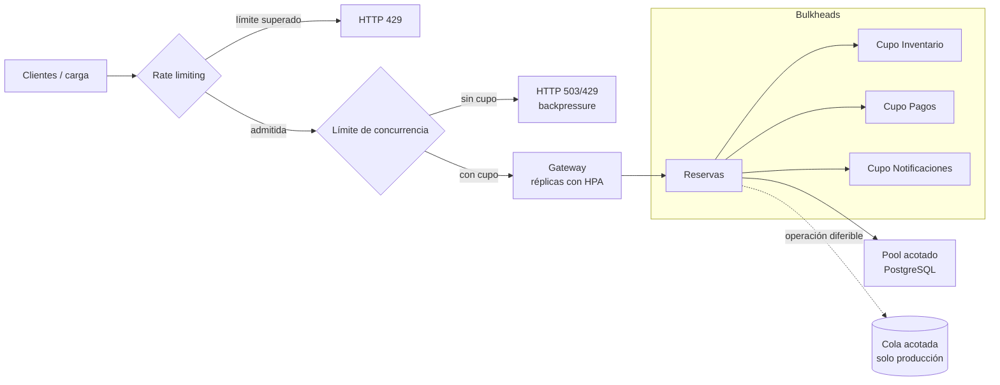
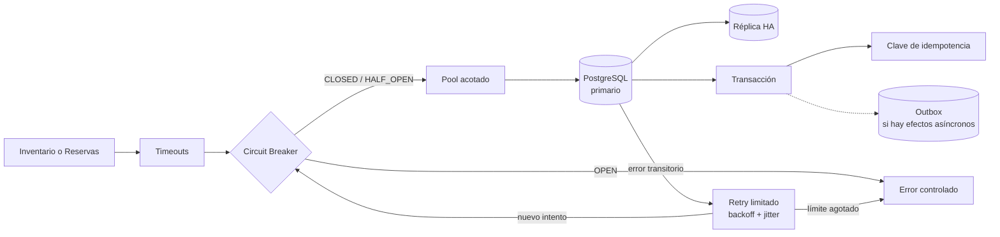

# Parte V: análisis teórico de fallos

Este documento analiza únicamente **Diluvio de Peticiones** y **Base de Datos Intermitente**. Las defensas descritas son propuestas de nivel producción; no se afirma que estén implementadas en el laboratorio.

## 1. Diluvio de Peticiones

### Descripción precisa

Un diluvio ocurre cuando la tasa de solicitudes entrantes supera durante suficiente tiempo la capacidad efectiva del API Gateway o de sus dependencias. La saturación puede aparecer en CPU, memoria, workers, sockets, conexiones HTTP o conexiones a PostgreSQL.

Cuando la capacidad de servicio es menor que la demanda, las solicitudes se acumulan en colas. Si las colas no tienen límites, crecen el consumo de memoria y el tiempo de espera. Si tienen límites, las nuevas solicitudes deben rechazarse o recibir backpressure.

> **[CITA MLR: fuente sobre saturación, teoría de colas y crecimiento de latencia bajo alta utilización]**

### Cómo se produce

Puede generarse con k6 o un script de carga que incremente progresivamente la concurrencia contra `POST /api/reservations`. Una prueba rigurosa debe controlar tasa, concurrencia, duración, distribución de solicitudes y capacidad inicial.

La carga atraviesa esta cadena:

```text
Cliente → API Gateway → Reservas → Inventario/Pagos/Notificaciones/PostgreSQL
```

Aunque el Gateway sea el primer componente afectado, cada solicitud aceptada genera trabajo adicional en varios servicios. El agotamiento de conexiones en cualquier punto puede propagar latencia hacia atrás.

### Efecto sobre el sistema construido

- El Gateway acumularía solicitudes y aumentaría su latencia.
- Reservas podría mantener más llamadas HTTP simultáneas hacia sus tres dependencias.
- Inventario y Reservas competirían por conexiones a PostgreSQL.
- Los timeouts provocarían solicitudes fallidas mientras el trabajo remoto podría continuar.
- Los retries de Inventario podrían multiplicar carga durante una degradación.
- Una dependencia lenta retendría recursos y reduciría la capacidad disponible para solicitudes sanas.
- La propagación de latencia podría terminar en fallos en cascada.

El laboratorio tiene una sola réplica de Gateway y Reservas. Inventario dispone de dos, pero ese aislamiento parcial no evita que una sobrecarga alcance PostgreSQL o las demás dependencias.

### Fundamento de sistemas distribuidos

La sobrecarga es un problema de capacidad y coordinación entre componentes con límites distintos. Una cola traslada el punto de espera, pero no crea capacidad. A medida que crece la utilización, aumenta de forma no lineal el tiempo que una solicitud pasa esperando recursos.

El backpressure comunica al emisor que el receptor no puede aceptar más trabajo. Sin esa señal, cada capa puede seguir admitiendo solicitudes y trasladar la saturación a la siguiente. Los límites deben ser coherentes a lo largo de toda la cadena.

Un fallo en cascada aparece cuando la lentitud de un componente consume recursos de sus clientes; esos clientes se vuelven lentos y afectan a otros consumidores.

> **[CITA MLR: fuente sobre backpressure, límites de colas y prevención de fallos en cascada]**

### Riesgos

- Latencia extrema y respuestas HTTP 5xx.
- Agotamiento de memoria por colas sin límite.
- Agotamiento de conexiones HTTP y del pool de base de datos.
- Reintentos sincronizados que amplifican el tráfico.
- Incapacidad de atender healthchecks o tráfico prioritario.
- Escalado tardío, cuando las solicitudes ya están acumuladas.
- Coste excesivo si el escalado automático responde a tráfico abusivo.

### Solución de nivel producción

| Mecanismo | Propuesta | Justificación |
|---|---|---|
| Rate limiting | Limitar solicitudes por cliente, ruta o ventana en el Gateway y responder HTTP 429 con información de reintento | Impide que una fuente monopolice la capacidad y rechaza trabajo antes de consumir recursos internos |
| HPA | Escalar Gateway y Reservas usando métricas de CPU y, preferentemente, concurrencia o tasa de solicitudes | Añade capacidad cuando la carga es legítima y sostenida |
| Requests y limits | Definir recursos para todos los pods y dimensionarlos con mediciones | Permite al scheduler reservar capacidad y limita el impacto de un contenedor descontrolado |
| Bulkhead | Separar pools o semáforos por dependencia o tipo de operación | Evita que Pagos lento consuma todos los recursos necesarios para Inventario u otras rutas |
| Límite de concurrencia | Mantener un máximo de solicitudes activas y una cola pequeña y acotada | Establece backpressure y mantiene predecible el uso de memoria |
| Réplicas | Escalar horizontalmente los componentes sin estado y distribuirlos entre nodos | Reduce la carga individual y evita depender de una única instancia |
| Cola de producción | Aceptar de forma asíncrona solo operaciones que toleren procesamiento diferido | Absorbe picos, pero cambia la semántica y requiere broker, idempotencia y operación adicional |

La cola es una opción de arquitectura de producción, no una propuesta para ampliar este laboratorio. Tampoco debe utilizarse para ocultar una capacidad permanentemente insuficiente.

> **[CITA MLR: evidencia sobre rate limiting, autoscaling, bulkheads y límites de concurrencia]**

### Pseudocódigo

```text
al recibir solicitud:
    si rate_limiter rechaza al cliente:
        devolver 429

    si no hay cupo en el límite de concurrencia:
        devolver 503 o 429 con Retry-After

    reservar cupo
    intentar:
        ejecutar operación con timeout
        devolver resultado
    finalmente:
        liberar cupo

periódicamente:
    HPA observa carga y concurrencia
    si la carga supera el objetivo:
        aumentar réplicas hasta el máximo configurado
```

### Diagrama Mermaid



### Limitaciones y trade-offs

- El rate limiting puede rechazar tráfico legítimo si la política es demasiado estricta.
- El HPA reacciona después de observar carga y no elimina los picos instantáneos.
- Más réplicas no ayudan si PostgreSQL es el cuello de botella.
- Requests y limits mal dimensionados producen throttling o desperdicio.
- Los bulkheads reservan capacidad, pero pueden dejar recursos ociosos.
- Una cola aumenta complejidad, latencia, coste operativo y necesidad de idempotencia.
- Rechazar temprano mejora estabilidad, pero reduce disponibilidad percibida durante el pico.

### Relación con la arquitectura del laboratorio

El punto natural para el rate limiting sería el API Gateway. Los límites de concurrencia y bulkheads corresponderían a Reservas, que concentra las llamadas salientes. El HPA podría aplicarse a Gateway y Reservas, mientras Inventario ya demuestra replicación básica.

Los manifiestos del laboratorio declaran requests y limits pequeños, pero no constituyen un diseño de capacidad validado. No existen rate limiting, HPA, bulkheads, métricas de carga ni cola. Por ello, Diluvio de Peticiones permanece como análisis teórico.

## 2. Base de Datos Intermitente

### Descripción precisa

Este fallo consiste en una partición, pérdida temporal de conectividad o degradación entre Inventario/Reservas y PostgreSQL. Puede incluir conexiones rechazadas, paquetes descartados, latencia elevada, conexiones que se cortan durante una transacción o pérdida de la respuesta después de un `COMMIT`.

El caso más delicado es el resultado incierto: el cliente no sabe si PostgreSQL confirmó la transacción antes de perderse la conexión.

> **[CITA MLR: fuente sobre fallos parciales, resultados inciertos y conectividad intermitente con bases de datos]**

### Cómo se produce

Una simulación rigurosa podría usar Toxiproxy, una NetworkPolicy compatible con el entorno o reglas de red controladas para introducir:

- cortes completos por intervalos;
- latencia y jitter;
- resets de conexión;
- pérdida de tráfico en una sola dirección;
- fallo justo antes o después de confirmar una transacción.

Cada variante representa una semántica distinta. Desconectar PostgreSQL antes de ejecutar una consulta no es equivalente a perder la confirmación después de un `COMMIT`.

### Efecto sobre el sistema construido

- Inventario podría responder HTTP 503 al consultar, reservar, liberar o restablecer asientos.
- Reservas podría fallar al guardar `confirmed` o `payment_failed`.
- Una reserva podría consumir un asiento o aprobar un pago y después no persistir su estado.
- Un retry indiscriminado podría repetir una operación cuyo primer resultado fue incierto.
- El pool podría conservar conexiones inválidas o agotarse esperando recuperación.
- La latencia de PostgreSQL se propagaría hacia Gateway y clientes.

### Fundamento de sistemas distribuidos

Los fallos parciales impiden asumir que ausencia de respuesta equivale a ausencia de ejecución. Si el cliente pierde conectividad tras enviar una escritura, existen al menos tres posibilidades: la base no la recibió, la abortó o la confirmó sin que la respuesta llegara.

Los retries ofrecen entrega *al menos una vez*, no ejecución exactamente una vez. Para evitar duplicación se necesita que la operación sea idempotente o que PostgreSQL reconozca una clave estable de operación.

CAP debe aplicarse con cuidado. Ante una partición real, un sistema distribuido no puede garantizar simultáneamente consistencia fuerte y disponibilidad para todas las operaciones. El PostgreSQL único del laboratorio normalmente preservará consistencia rechazando o bloqueando operaciones que no puede confirmar, a costa de disponibilidad. CAP no explica por sí solo timeouts, rendimiento normal ni todos los fallos de una aplicación.

> **[CITA MLR: fuente sobre CAP aplicada con precisión y semántica de retries]**

### Riesgos

- Reservas duplicadas por reintentos sin clave de idempotencia.
- Asientos descontados sin una reserva persistida.
- Pagos aprobados con resultado local desconocido.
- Transacciones abiertas o conexiones agotadas.
- Tormentas de retries sincronizados.
- Circuitos abiertos durante más tiempo del necesario.
- Failover de PostgreSQL con pérdida de datos si la replicación no es suficientemente síncrona.

### Solución de nivel producción

| Mecanismo | Propuesta | Justificación |
|---|---|---|
| Timeout | Limitar conexión, adquisición del pool y ejecución de consultas | Evita bloquear workers indefinidamente y acota la latencia propagada |
| Retries limitados | Reintentar solo errores transitorios, con máximo pequeño | Permite superar cortes breves sin crear bucles infinitos |
| Exponential backoff y jitter | Separar temporalmente los reintentos y añadir variación aleatoria | Reduce sincronización y presión sobre una base que se está recuperando |
| Circuit Breaker | Abrir después de fallos consecutivos y probar recuperación en HALF_OPEN | Evita seguir consumiendo conexiones durante una caída sostenida |
| Claves de idempotencia | Asociar cada operación lógica con una clave única persistida | Permite reconocer un retry y devolver el resultado previo sin repetir efectos |
| Transacciones | Agrupar cambios que deben confirmarse o abortarse juntos | Mantiene invariantes locales y evita estados parciales dentro de PostgreSQL |
| PostgreSQL en alta disponibilidad | Usar primario y réplicas con failover probado, backups y objetivos de pérdida definidos | Reduce el punto único de fallo, aunque no elimina resultados inciertos |
| Pool de conexiones | Acotar tamaño, tiempos de espera, reciclado y validación de conexiones | Protege PostgreSQL y evita que conexiones dañadas ocupen todo el pool |
| Outbox | Escribir estado y evento pendiente en la misma transacción cuando existan efectos externos asíncronos | Evita perder la intención de un efecto externo después de confirmar la base |

El Outbox solo resulta apropiado si una versión de producción introduce entrega asíncrona y un publicador. No está implementado ni se necesita en el alcance actual.

> **[CITA MLR: evidencia sobre idempotencia, backoff con jitter, Circuit Breaker, HA de PostgreSQL y Outbox]**

### Pseudocódigo

```text
procesar operación(clave_idempotencia, datos):
    si circuit_breaker está OPEN:
        devolver error controlado

    para intento desde 0 hasta 2:
        intentar:
            iniciar transacción

            resultado_previo = buscar clave_idempotencia
            si existe:
                confirmar lectura
                registrar éxito en circuit_breaker
                devolver resultado_previo

            ejecutar cambio de negocio
            guardar clave_idempotencia y resultado
            guardar registro Outbox si existe un efecto externo asíncrono
            commit

            registrar éxito en circuit_breaker
            devolver resultado

        capturar error transitorio:
            rollback si todavía es posible
            registrar fallo en circuit_breaker

            si el resultado del commit es incierto:
                consultar primero la clave de idempotencia

            si no quedan intentos:
                devolver error controlado

            esperar min(base * 2^intento, máximo) + jitter
```

### Diagrama Mermaid



### Limitaciones y trade-offs

- Los timeouts demasiado cortos producen falsos fallos; demasiado largos retienen recursos.
- Los retries aumentan carga y solo son seguros cuando se conoce la semántica de la operación.
- El Circuit Breaker reduce presión, pero rechaza solicitudes durante su ventana abierta.
- La idempotencia requiere almacenamiento, retención y reglas para conflictos de claves.
- Alta disponibilidad aumenta coste, complejidad y necesidad de probar failover.
- Replicación asíncrona puede perder escrituras recientes; replicación síncrona aumenta latencia.
- Pools grandes pueden saturar PostgreSQL; pools pequeños limitan concurrencia.
- Outbox necesita publicación, limpieza y consumidores idempotentes.

### Relación con la arquitectura del laboratorio

Inventario y Reservas son los clientes directos de PostgreSQL. El SQL atómico de Inventario protege la condición de carrera dentro de una conexión funcional, pero no resuelve por sí solo una pérdida de conectividad o un resultado de commit incierto.

El laboratorio utiliza una sola instancia de PostgreSQL con PVC y manejo básico de errores de SQLAlchemy. No implementa retries de base de datos, Circuit Breaker para PostgreSQL, claves de idempotencia, alta disponibilidad ni Outbox. Una simulación rigurosa requeriría infraestructura y criterios de resultado adicionales, por lo que Base de Datos Intermitente permanece como análisis teórico.
